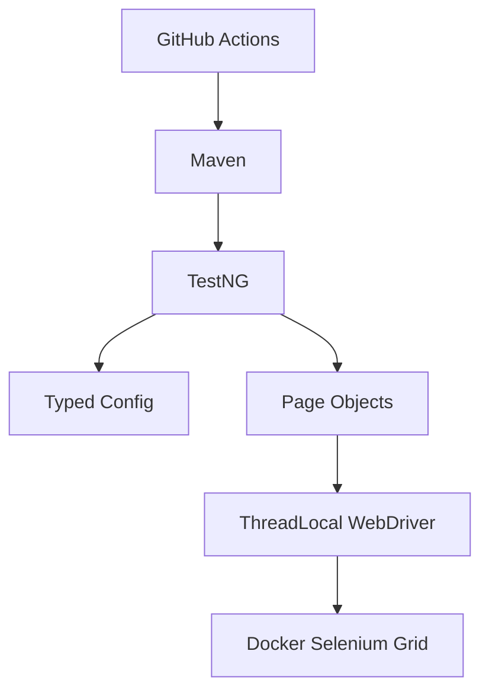
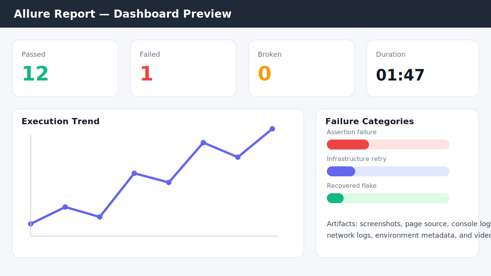
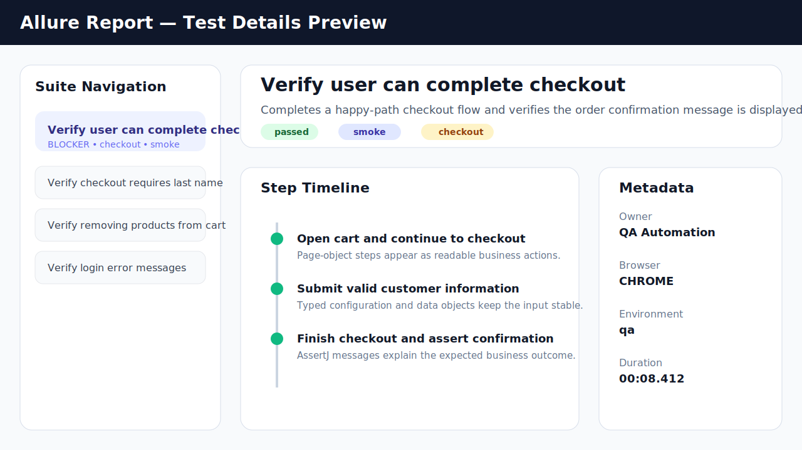
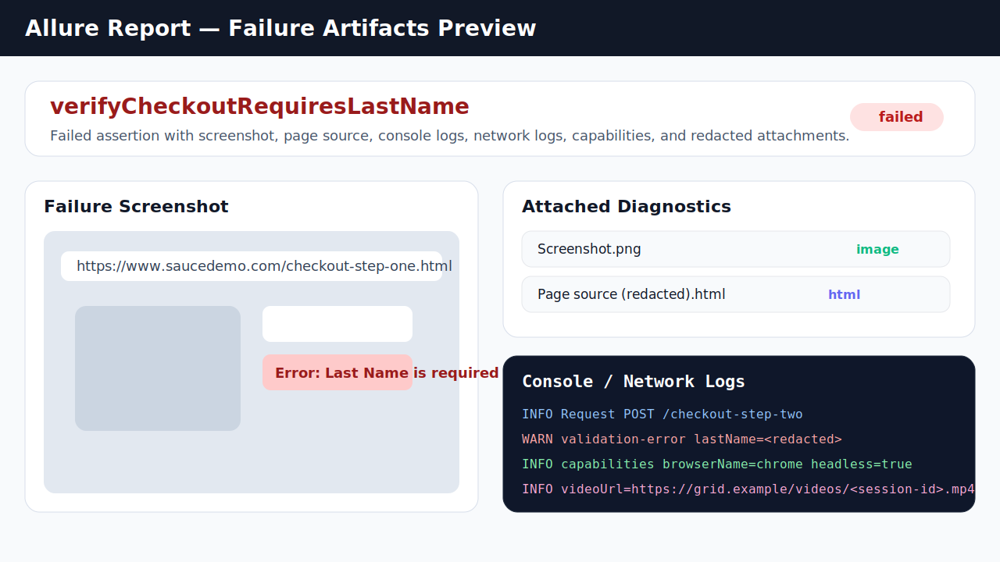

# Selenium Java TestNG Automation Framework

[](https://github.com/prayag/ta-java-selenium-testng/actions/workflows/ui-tests.yml)
[](https://prayag.github.io/ta-java-selenium-testng/)


Java 21 UI test automation framework for Sauce Demo, built with Selenium 4, TestNG, AssertJ, custom typed configuration, Log4j2, Docker/Selenium Grid, and Allure reporting.

The `UI Tests` workflow publishes per-browser Allure artifacts on every run and deploys the merged report to GitHub Pages from `main`. After enabling GitHub Pages on a fork, the live report will be available at `https://<owner>.github.io/<repo>/`.

## Why This Framework?
- **Why custom config?** Uses a small typed configuration layer to avoid a stale external dependency while preserving layered overrides.
- **Why ThreadLocal WebDriver?** Ensures robust, thread-safe parallel execution by isolating driver instances per thread.
- **Why cookie auth shortcuts?** Non-login scenarios bypass the UI login form to keep the suite faster and less flaky while retaining dedicated login coverage.
- **Why explicit waits only?** A single synchronization strategy keeps the framework deterministic and easier to debug.
- **Why no framework unit-test layer?** This repository is intentionally focused on UI automation design, execution, and diagnostics rather than maintaining a second test layer for framework internals.

## Documentation
- [Architecture Overview](docs/ARCHITECTURE.md) - Layers, design decisions, and framework structure.
- [Execution Guide](docs/EXECUTION_GUIDE.md) - Local, headless, Docker Grid, and CI execution.
- [Test Writing Guide](docs/TEST_WRITING_GUIDE.md) - Page object and test authoring conventions.
- [Changelog](CHANGELOG.md) - Framework evolution derived from repository history.

## Live Report

- [Interactive Allure Report](https://prayag.github.io/ta-java-selenium-testng/)

## Architecture



## Features
- Java 21 and Maven wrapper for repeatable local and CI execution.
- Selenium Grid support through Docker Compose.
- Custom typed configuration with classpath-based profile loading and system/environment overrides.
- Page objects and reusable page components with explicit, caller-controlled page readiness checks.
- Automation-only `src/test/java` scope for UI suites, test data, and TestNG orchestration.
- TestNG groups, parallel method execution, and opt-in retry support.
- Allure reports with redacted screenshots, URL, page source, capabilities, console logs, network logs, and framework log excerpts on failure.
- Spotless, Checkstyle, PMD, SpotBugs, and Maven Enforcer quality gates with stronger maintainability rules.
- GitHub Actions browser matrix, artifact upload, and GitHub Pages publication for Allure reports.

## Sample Allure Report

Representative report views are included below so reviewers can see the diagnostics quality without running the framework first.







## Framework Highlights
- Thread-safe parallel execution through `ThreadLocal<WebDriver>`.
- Shared per-thread wait helper reuse across pages and components.
- Explicit-only wait strategy with implicit waits set to zero.
- Cookie-based authentication strategy for non-login scenarios.
- Page Component Model for shared header and inventory list behavior.
- Opt-in retry analyzer with Allure retry context.
- CI-ready quality gates for formatting, style checks, dependency rules, tests, and reporting.

## Known Limitations
- Forked pull requests run only no-secret UI smoke coverage (`inventory`, `cart`). Full login regression requires repository secrets.
- Safari remains local headed macOS-only and requires Safari remote automation to be enabled manually.
- The product catalog assertions intentionally use static data because Sauce Demo exposes a fixed demo inventory.

## Quick Start

Run the no-secret smoke suite locally:

```bash
./mvnw clean test -Dgroups=inventory,cart -Dheadless=true
```

Run the full regression with login coverage:

```bash
APP_PASSWORD=your_password ./mvnw clean verify -Dheadless=true -Dbrowser=CHROME
```

## Getting Started

### Prerequisites
- JDK 21
- Maven 3.9+ or the included Maven wrapper
- Docker and Docker Compose for Selenium Grid execution

### Local Run
```bash
APP_PASSWORD=your_password ./mvnw clean verify
```

Run no-secret UI smoke coverage without login scenarios:
```bash
./mvnw clean test -Dgroups=inventory,cart -Dheadless=true
```

Use headless mode or a different browser when needed:
```bash
APP_PASSWORD=your_password ./mvnw clean verify -Dheadless=true -Dbrowser=FIREFOX
```

Run a trusted full regression against a specific profile:
```bash
APP_PASSWORD=your_password ./mvnw clean verify -Denv=dev -Dheadless=true -Dbrowser=CHROME
```

### Docker Grid Run
```bash
APP_PASSWORD=your_password docker compose up --build --exit-code-from test-runner
```

To include the optional Edge node in the local grid, start Docker Compose with the Edge profile:

```bash
APP_PASSWORD=your_password docker compose --profile edge up --build --exit-code-from test-runner
```

For video-enabled Selenium Grid setups, publish the recording endpoint and set `diagnostics.grid.video.base.url` so failed tests include session video links in Allure.

### Allure Dashboard
```bash
./mvnw allure:serve
```

To generate an Allure report even when tests fail, use the helper scripts in `scripts/`:
```bash
./scripts/run-ui-tests-with-allure-report.sh
```

On `main`, GitHub Actions also starts Selenium Grid browser nodes per matrix entry, merges browser-matrix results, uploads the generated report as artifacts, and deploys the published report to GitHub Pages.

## Configuration
Configuration is loaded from classpath resources (`src/test/resources/config.properties`, profile files such as `qa.properties` / `dev.properties`), an optional external file supplied via `-Dconfig.file`, environment variables, and system properties. Later sources override earlier ones, so Maven `-D` values have the highest priority. The active environment resolves in this order: `-Denv`, environment variable `ENV`, environment variable `env`, then `qa`.

| Property | Description | Default |
|----------|-------------|---------|
| `browser` | Browser type: `CHROME`, `FIREFOX`, `EDGE`, `SAFARI` | `CHROME` |
| `execution.type` | `local` or `remote` | `local` |
| `remote.url` | Selenium Grid URL | blank |
| `headless` | Run browser headlessly | `false` |
| `maximize.window` | Maximize headed local browser windows | `true` |
| `viewport.width` | Browser viewport width for deterministic runs | `1920` |
| `viewport.height` | Browser viewport height for deterministic runs | `1080` |
| `thread.count` | TestNG method thread count | `1` |
| `diagnostics.network.logs.enabled` | Attach Chrome/Edge performance logs on failure | `false` |
| `diagnostics.grid.video.base.url` | Optional base URL for Selenium Grid video links | blank |
| `explicit.wait.seconds` | Explicit wait timeout | `10` |
| `polling.interval.ms` | Explicit wait polling interval in milliseconds | `500` |
| `page.load.timeout.seconds` | Page load timeout | `30` |
| `script.timeout.seconds` | Script timeout | `30` |
| `retry.enabled` | Enable TestNG retry analyzer | `false` |
| `retry.count` | Retry count when retries are enabled | `2` |

Credentials are supplied through environment variables or Maven system properties. Prefer environment variables locally and GitHub Actions secrets in CI so passwords are not written into Maven command lines. `APP_PASSWORD` is required only for login scenarios; inventory/cart UI smoke coverage can run without it. Do not commit real credentials to repository files.

## Browser Support
| Browser | Local headed | Local headless | Docker Grid | GitHub Actions |
|---------|--------------|----------------|-------------|----------------|
| Chrome | Supported | Supported | Supported | Supported |
| Firefox | Supported | Supported | Supported | Supported |
| Edge | Supported | Supported | Supported via optional `edge` profile | Supported |
| Safari | macOS-only experimental | Not supported | Not supported | Not supported |

## Branch Protection
Recommended GitHub branch protection for `main`:
- Require pull request reviews before merge.
- Require the `UI Tests` workflow to pass.
- Require branches to be up to date before merging.
- Restrict direct pushes to maintainers.

## Tech Stack
- Java 21
- Selenium 4
- TestNG
- AssertJ
- Allure
- Log4j2 and SLF4J
- Lombok
- Custom typed config loader
- Docker Compose and Selenium Grid
