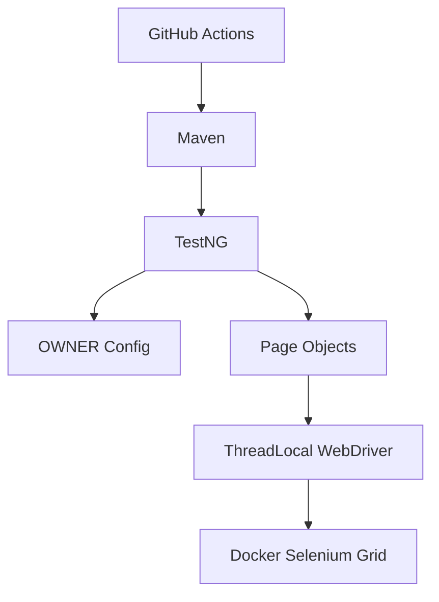

# Selenium Java TestNG Automation Framework


👉 [View Live Test Report Here](https://user.github.io/ta-java-selenium-testng/)

Java 21 UI test automation framework for Sauce Demo, built with Selenium 4, TestNG, AssertJ, OWNER configuration, Log4j2, Docker/Selenium Grid, and Allure reporting.

## Documentation
- [Architecture Overview](docs/ARCHITECTURE.md) - Layers, design decisions, and framework structure.
- [Execution Guide](docs/EXECUTION_GUIDE.md) - Local, headless, Docker Grid, and CI execution.
- [Test Writing Guide](docs/TEST_WRITING_GUIDE.md) - Page object and test authoring conventions.

## Architecture



## Features
- Java 21 and Maven wrapper for repeatable local and CI execution.
- Selenium Grid support through Docker Compose.
- OWNER-based typed configuration with environment-specific properties.
- Page objects and reusable page components with waits inside page actions.
- TestNG groups, parallel method execution, and opt-in retry support.
- Allure reports with screenshots, URL, page source, capabilities, and console logs on failure.
- Spotless, Checkstyle, and Maven Enforcer quality gates.

## Getting Started

### Prerequisites
- JDK 21
- Maven 3.9+ or the included Maven wrapper
- Docker and Docker Compose for Selenium Grid execution

### Local Run
```bash
./mvnw clean verify -DAPP_PASSWORD=your_password
```

Use headless mode or a different browser when needed:
```bash
./mvnw clean verify -DAPP_PASSWORD=your_password -Dheadless=true -Dbrowser=FIREFOX
```

### Docker Grid Run
```bash
APP_PASSWORD=your_password docker compose up --build --exit-code-from test-runner
```

### Allure Dashboard
```bash
./mvnw allure:serve
```

## Configuration
Configuration is loaded from system properties, environment variables, profile files, and `src/test/resources/config.properties`.

| Property | Description | Default |
|----------|-------------|---------|
| `browser` | Browser type: `CHROME`, `FIREFOX`, `EDGE`, `SAFARI` | `CHROME` |
| `execution.type` | `local` or `remote` | `local` |
| `remote.url` | Selenium Grid URL | blank |
| `headless` | Run browser headlessly | `false` |
| `explicit.wait.seconds` | Explicit wait timeout | `10` |
| `page.load.timeout.seconds` | Page load timeout | `30` |
| `script.timeout.seconds` | Script timeout | `30` |
| `retry.enabled` | Enable TestNG retry analyzer | `false` |
| `retry.count` | Retry count when retries are enabled | `2` |

Credentials are supplied through environment variables or Maven system properties. Do not commit real credentials to repository files.

## Tech Stack
- Java 21
- Selenium 4
- TestNG
- AssertJ
- Allure
- Log4j2 and SLF4J
- Lombok
- OWNER
- Docker Compose and Selenium Grid
