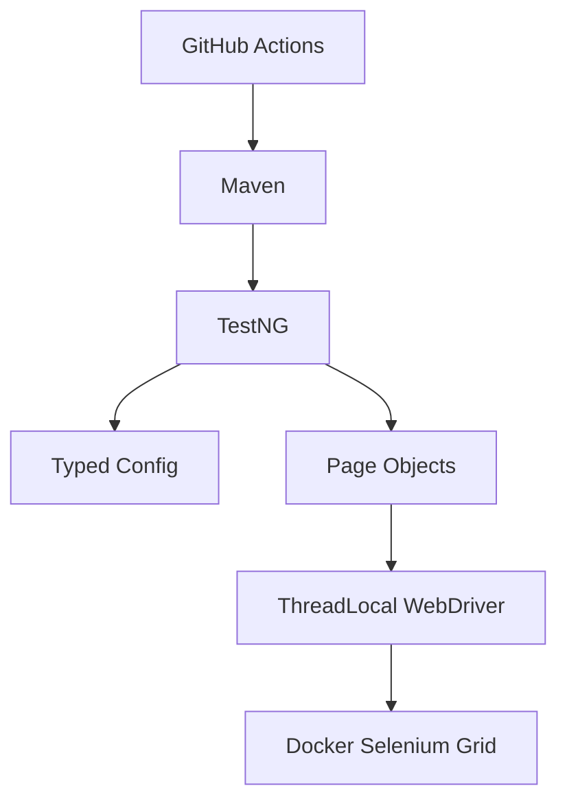

# Selenium Java TestNG Automation Framework


[View Live Allure Report](https://prayag.github.io/ta-java-selenium-testng/)

Java 21 UI test automation framework for Sauce Demo, built with Selenium 4, TestNG, AssertJ, custom typed configuration, Log4j2, Docker/Selenium Grid, and Allure reporting.

## Architecture Considerations
- **Why custom config?** Uses a small typed configuration layer to avoid a stale external dependency while preserving layered overrides.
- **Why ThreadLocal WebDriver?** Ensures robust, thread-safe parallel execution by isolating driver instances per thread.

## Documentation
- [Architecture Overview](docs/ARCHITECTURE.md) - Layers, design decisions, and framework structure.
- [Execution Guide](docs/EXECUTION_GUIDE.md) - Local, headless, Docker Grid, and CI execution.
- [Test Writing Guide](docs/TEST_WRITING_GUIDE.md) - Page object and test authoring conventions.

## Architecture



## Features
- Java 21 and Maven wrapper for repeatable local and CI execution.
- Selenium Grid support through Docker Compose.
- Custom typed configuration with environment-specific properties and system/environment overrides.
- Page objects and reusable page components with waits inside page actions.
- TestNG groups, parallel method execution, and opt-in retry support.
- Allure reports with screenshots, URL, page source, capabilities, and console logs on failure.
- Spotless, Checkstyle, and Maven Enforcer quality gates.

## Framework Highlights
- Thread-safe parallel execution through `ThreadLocal<WebDriver>`.
- Explicit-only wait strategy with implicit waits set to zero.
- Cookie-based authentication shortcut for non-login scenarios.
- Page Component Model for shared header and inventory list behavior.
- Opt-in retry analyzer with Allure retry context.
- CI-ready quality gates for formatting, style checks, dependency rules, tests, and reporting.

## Getting Started

### Prerequisites
- JDK 21
- Maven 3.9+ or the included Maven wrapper
- Docker and Docker Compose for Selenium Grid execution

### Local Run
```bash
APP_PASSWORD=your_password ./mvnw clean verify
```

Use headless mode or a different browser when needed:
```bash
APP_PASSWORD=your_password ./mvnw clean verify -Dheadless=true -Dbrowser=FIREFOX
```

### Docker Grid Run
```bash
APP_PASSWORD=your_password docker compose up --build --exit-code-from test-runner
```

### Allure Dashboard
```bash
./mvnw allure:serve
```

## Configuration
Configuration is loaded from `src/test/resources/config.properties`, optional profile files such as `qa.properties`, environment variables, and system properties. Later sources override earlier ones, so Maven `-D` values have the highest priority.

| Property | Description | Default |
|----------|-------------|---------|
| `browser` | Browser type: `CHROME`, `FIREFOX`, `EDGE`, `SAFARI` | `CHROME` |
| `execution.type` | `local` or `remote` | `local` |
| `remote.url` | Selenium Grid URL | blank |
| `headless` | Run browser headlessly | `false` |
| `maximize.window` | Maximize headed local browser windows | `true` |
| `viewport.width` | Browser viewport width for deterministic runs | `1920` |
| `viewport.height` | Browser viewport height for deterministic runs | `1080` |
| `thread.count` | TestNG method thread count | `1` |
| `diagnostics.network.logs.enabled` | Attach Chrome/Edge performance logs on failure | `false` |
| `diagnostics.grid.video.base.url` | Optional base URL for Selenium Grid video links | blank |
| `explicit.wait.seconds` | Explicit wait timeout | `10` |
| `polling.interval.ms` | Explicit wait polling interval in milliseconds | `500` |
| `page.load.timeout.seconds` | Page load timeout | `30` |
| `script.timeout.seconds` | Script timeout | `30` |
| `retry.enabled` | Enable TestNG retry analyzer | `false` |
| `retry.count` | Retry count when retries are enabled | `2` |

Credentials are supplied through environment variables or Maven system properties. Prefer environment variables locally and GitHub Actions secrets in CI so passwords are not written into Maven command lines. Do not commit real credentials to repository files.

## Browser Support
| Browser | Local headed | Local headless | Docker Grid | GitHub Actions |
|---------|--------------|----------------|-------------|----------------|
| Chrome | Supported | Supported | Supported | Supported |
| Firefox | Supported | Supported | Supported | Supported |
| Edge | Supported | Supported | Not configured | Not configured |
| Safari | macOS-only experimental | Not supported | Not supported | Not supported |

## Branch Protection
Recommended GitHub branch protection for `main`:
- Require pull request reviews before merge.
- Require the `UI Tests` workflow to pass.
- Require branches to be up to date before merging.
- Restrict direct pushes to maintainers.

## Tech Stack
- Java 21
- Selenium 4
- TestNG
- AssertJ
- Allure
- Log4j2 and SLF4J
- Lombok
- Custom typed config loader
- Docker Compose and Selenium Grid
