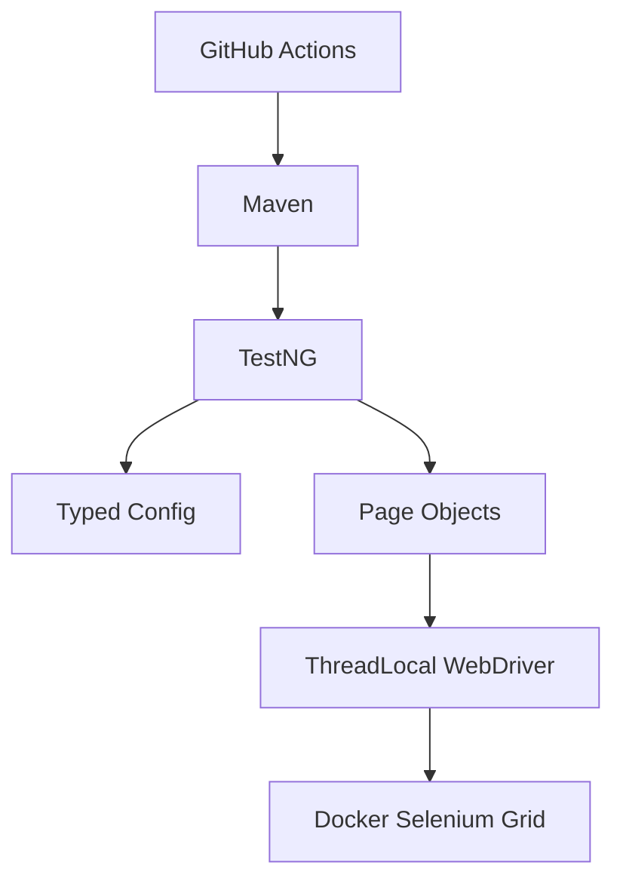
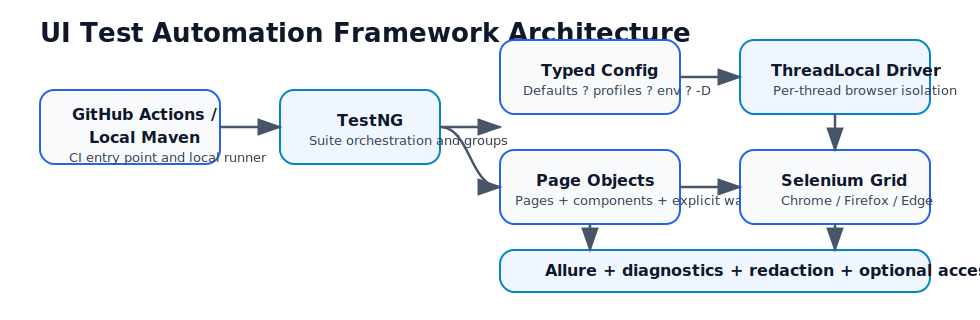
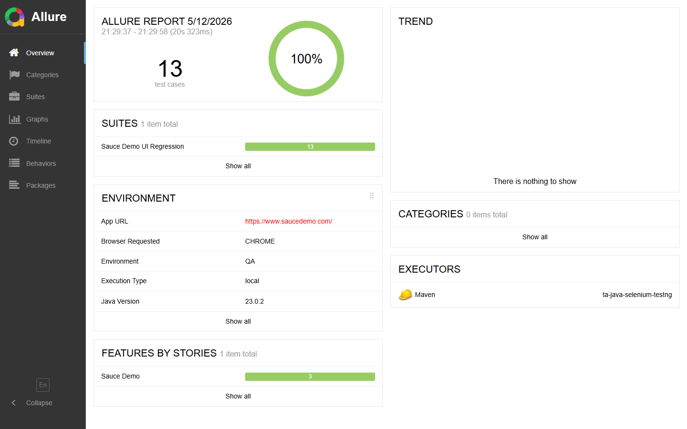
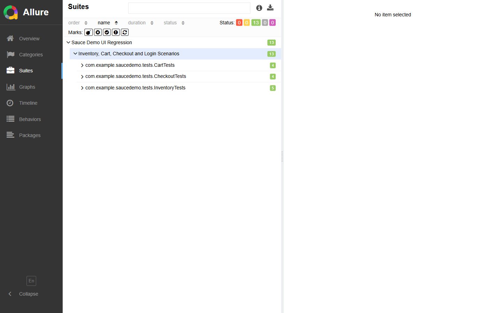
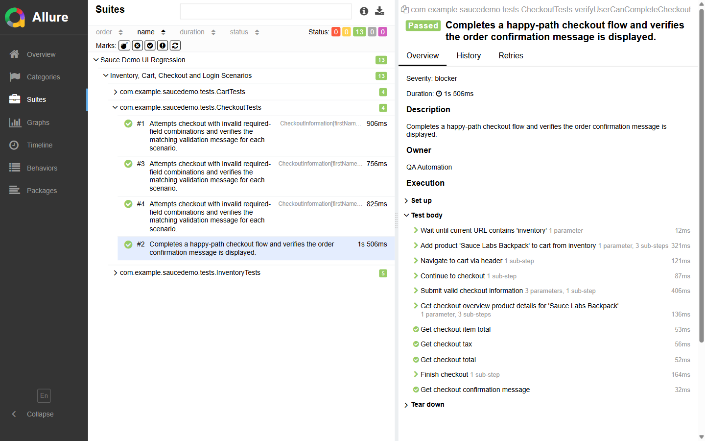

# Selenium Java TestNG Automation Framework

[](https://github.com/prayag/ta-java-selenium-testng/actions/workflows/ui-tests.yml)
[](https://prayag.github.io/ta-java-selenium-testng/)


Java 21 UI test automation framework for Sauce Demo, built with Selenium 4, TestNG, AssertJ, custom typed configuration, Log4j2, Docker/Selenium Grid, and Allure reporting.

The `UI Tests` workflow publishes per-browser Allure artifacts on every run and deploys the merged report to GitHub Pages from `main`. After enabling GitHub Pages on a fork, the live report will be available at `https://<owner>.github.io/<repo>/`.

## Why This Framework?
- **Why custom config?** Uses a small typed configuration layer to avoid a stale external dependency while preserving layered overrides.
- **Why ThreadLocal WebDriver?** Ensures robust, thread-safe parallel execution by isolating driver instances per thread.
- **Why cookie auth shortcuts?** Non-login scenarios bypass the UI login form to keep the suite faster and less flaky while retaining dedicated login coverage.
- **Why explicit waits only?** A single synchronization strategy keeps the framework deterministic and easier to debug.
- **Why no framework tests?** This repository stays focused on browser-driven user flows. Framework code is validated through UI scenarios, quality gates, and review rather than isolated helper tests. See [ADR 005](docs/adr/005-why-no-framework-unit-tests.md).

## Documentation
- [Architecture Overview](docs/ARCHITECTURE.md) - Layers, design decisions, and framework structure.
- [Execution Guide](docs/EXECUTION_GUIDE.md) - Local, headless, Docker Grid, and CI execution.
- [Test Writing Guide](docs/TEST_WRITING_GUIDE.md) - Page object and test authoring conventions.
- [Debugging Guide](docs/DEBUGGING_GUIDE.md) - How to use Allure artifacts, logs, screenshots, and CI outputs to diagnose failures.
- [GitHub Setup Guide](docs/GITHUB_SETUP.md) - Required secrets, Pages, branch protection, and workflow checks.
- [ADR 005](docs/adr/005-why-no-framework-unit-tests.md) - Why this UI automation project does not add framework unit tests.
- [Changelog](CHANGELOG.md) - Framework evolution derived from repository history.

## Live Report

- [Interactive Allure Report](https://prayag.github.io/ta-java-selenium-testng/)

## Architecture





## Features
- Java 21 and Maven wrapper for repeatable local and CI execution.
- Selenium Grid support through Docker Compose.
- Custom typed configuration with classpath-based profile loading and system/environment overrides.
- Page objects and reusable page components with explicit, caller-controlled page readiness checks.
- `src/main/java` contains reusable automation framework and app page-object code; `src/test/java` contains executable TestNG scenarios and test data.
- TestNG groups, parallel method execution, and opt-in retry support.
- Opt-in accessibility smoke coverage through a dedicated `accessibility` suite.
- Opt-in visual regression scaffold through a dedicated `visual` suite and baseline-manager helper.
- Allure reports with redacted screenshots, URL, execution environment summary, page source, capabilities, console logs, network logs, and bounded framework log excerpts on failure.
- Spotless, Checkstyle, PMD, SpotBugs, and Maven Enforcer quality gates with stronger maintainability rules.
- GitHub Actions browser matrix, artifact upload, and GitHub Pages publication for Allure reports.
- Digest-pinned Docker and Selenium Grid images for reproducible container execution.

## Sample Allure Report

Representative report views are included below so reviewers can see the diagnostics quality without running the framework first.







## Framework Highlights
- Thread-safe parallel execution through `ThreadLocal<WebDriver>`.
- Shared per-thread wait helper reuse across pages and components.
- Explicit-only wait strategy with implicit waits set to zero.
- Cookie-based authentication strategy for non-login scenarios.
- Page Component Model for shared header, inventory list, and root-scoped product item behavior.
- Opt-in retry analyzer with required retry reasons and Allure retry context.
- CI-ready quality gates for formatting, style checks, dependency rules, tests, and reporting.

## Known Limitations
- Forked pull requests run only no-secret UI smoke coverage (`inventory`, `cart`). Full login regression requires repository secrets.
- Safari remains local headed macOS-only and requires Safari remote automation to be enabled manually.
- The product catalog assertions intentionally use static data because Sauce Demo exposes a fixed demo inventory.

## Quick Start

Run the no-secret smoke suite locally:

```bash
./mvnw clean test -Dgroups=inventory,cart -Dheadless=true
```

PowerShell requires quotes around comma-separated groups and dotted Maven properties:

```powershell
.\mvnw.cmd test '-Dgroups=inventory,cart' -Dheadless=true -Dbrowser=CHROME '-Dthread.count=2'
```

Run the full regression with login coverage:

```bash
export APP_PASSWORD="<set-outside-repository>"
./mvnw clean verify -Dheadless=true -Dbrowser=CHROME
```

## Getting Started

### Prerequisites
- JDK 21
- Maven 3.9+ or the included Maven wrapper
- Docker and Docker Compose for Selenium Grid execution

### Local Run
```bash
export APP_PASSWORD="<set-outside-repository>"
./mvnw clean verify
```

PowerShell users should set `$env:APP_PASSWORD = "<set-outside-repository>"` before running password-backed login, persona, journey, or full-regression scenarios.

Run no-secret UI smoke coverage without login scenarios:
```bash
./mvnw clean test -Dgroups=inventory,cart -Dheadless=true
```

Use headless mode or a different browser when needed:
```bash
export APP_PASSWORD="<set-outside-repository>"
./mvnw clean verify -Dheadless=true -Dbrowser=FIREFOX
```

Run a trusted full regression against a private external profile:
```bash
export APP_PASSWORD="<set-outside-repository>"
./mvnw clean verify -Denv=dev -Dconfig.file=/path/to/dev.properties -Dheadless=true -Dbrowser=CHROME
```

### Docker Grid Run
```bash
export APP_PASSWORD="<set-outside-repository>"
docker compose up --build --exit-code-from test-runner
```

To include the optional Edge node in the local grid, start Docker Compose with the Edge profile:

```bash
export APP_PASSWORD="<set-outside-repository>"
docker compose --profile edge up --build --exit-code-from test-runner
```

For video-enabled Selenium Grid setups, publish the recording endpoint and set `diagnostics.grid.video.base.url` so failed tests include session video links in Allure. The bundled Grid is intentionally lightweight and does not record videos by itself.

### Allure Dashboard
```bash
./mvnw allure:serve
```

To generate an Allure report even when tests fail, use the helper scripts in `scripts/`:
```bash
./scripts/run-ui-tests-with-allure-report.sh
```

On `main`, GitHub Actions also starts Selenium Grid browser nodes per matrix entry, merges browser-matrix results, uploads the generated report as artifacts, and deploys the published report to GitHub Pages.

Run the opt-in accessibility smoke suite locally:

```powershell
.\mvnw.cmd test '-Dtestng.suite.file=testng-accessibility.xml' '-Dgroups=accessibility' -Dheadless=true -Dbrowser=CHROME
```

The accessibility suite fails only on blocking baseline issues and records structural advisories as separate Allure attachments so known third-party app quirks remain visible without destabilizing the default regression path.

Run the opt-in visual regression scaffold locally:

```powershell
.\mvnw.cmd test '-Dtestng.suite.file=testng-visual.xml' '-Dgroups=visual' -Dheadless=true -Dbrowser=CHROME -Dvisual.auto.approve=true
```

The first reviewed run can approve a baseline hash with `-Dvisual.auto.approve=true`. Later runs compare against the approved hash in `visual.baseline.dir`.

For cloud-grid execution examples, see `src/test/resources/browserstack.properties.example` and the remote-execution section in the Execution Guide.

## Configuration
Configuration is loaded from built-in safe defaults, optional classpath resources (`config.properties`, profile files such as `qa.properties` / `dev.properties`), an optional external file supplied via `-Dconfig.file`, environment variables, and system properties. Later sources override earlier ones, so Maven `-D` values have the highest priority. The active environment resolves in this order: `-Denv`, environment variable `ENV`, environment variable `env`, then `qa`. The default `qa` environment can run from built-in safe defaults. Non-default environments must have a matching classpath profile or an external `-Dconfig.file`; otherwise startup fails loudly. Public-safe examples live in `src/test/resources/*.example`; keep private local overrides in an ignored external file and pass it with `-Dconfig.file`. Environment variable overrides apply only to known configuration keys, and normalized credential keys (`app.username`, `app.password`) still map automatically from `APP_USERNAME` and `APP_PASSWORD` for CI-friendly secret injection.

The `.env.example` file is a convenience template for Docker Compose or for manually exporting shell variables. Local Maven runs do not auto-load `.env`.

| Property | Description | Default |
|----------|-------------|---------|
| `browser` | Browser type: `CHROME`, `FIREFOX`, `EDGE`, `SAFARI` | `CHROME` |
| `execution.type` | `local` or `remote` | `local` |
| `remote.url` | Selenium Grid URL | blank |
| `headless` | Run browser headlessly | `false` |
| `maximize.window` | Maximize headed local browser windows | `true` |
| `browser.version` | Optional remote/browser version capability | blank |
| `platform.name` | Optional remote platform capability | blank |
| `accept.insecure.certs` | Set Selenium `acceptInsecureCerts` capability | `false` |
| `remote.capabilities` | Optional flat JSON object of extra remote capabilities | blank |
| `viewport.width` | Browser viewport width for deterministic runs | `1920` |
| `viewport.height` | Browser viewport height for deterministic runs | `1080` |
| `thread.count` | TestNG method thread count | `1` |
| `diagnostics.network.logs.enabled` | Attach Chrome/Edge performance logs on failure | `false` |
| `diagnostics.grid.video.base.url` | Optional base URL for Selenium Grid video links | blank |
| `diagnostics.attach.screenshot.on.failure` | Attach failure screenshots to Allure | `true` |
| `diagnostics.attach.page.source.on.failure` | Attach redacted page source to Allure | `true` |
| `diagnostics.attach.browser.logs.on.failure` | Attach browser console logs to Allure | `true` |
| `diagnostics.attach.framework.logs.on.failure` | Attach framework log excerpts to Allure | `true` |
| `diagnostics.sensitive.dom.selectors` | CSS selectors masked before screenshot/page-source capture | password, email, token, secret, and `[data-sensitive='true']` selectors |
| `explicit.wait.seconds` | Explicit wait timeout | `10` |
| `polling.interval.ms` | Explicit wait polling interval in milliseconds | `500` |
| `page.load.timeout.seconds` | Page load timeout | `30` |
| `script.timeout.seconds` | Script timeout | `30` |
| `retry.enabled` | Enable TestNG retry analyzer | `false` |
| `retry.count` | Retry count when retries are enabled | `2` |
| `allow.passwordless.skips` | Allow password-backed tests to skip when `APP_PASSWORD` is missing | `false` |

Tests annotated with `@Retryable(reason = "...")` are eligible for retry when `retry.enabled=true`. Every retryable test must declare why retry is acceptable. The retry summary is attached to Allure at suite finish so retry behavior is visible in reports.

Credentials are supplied through environment variables or Maven system properties. Prefer setting environment variables before running Maven and use GitHub Actions secrets in CI so passwords are not written into Maven command lines or committed files. Full regression and password-backed login/persona/journey scenarios fail fast when `APP_PASSWORD` is missing. Inventory/cart UI smoke coverage can run without it; use `allow.passwordless.skips=true` only for intentional public no-secret demonstrations. Do not commit real credentials to repository files.

The Allure issue-link pattern defaults to this repository and can be overridden with `-Dallure.issue.pattern=https://github.com/<owner>/<repo>/issues/{}`.

## Fork Setup Notes

After forking, update the badge URLs, repository secrets, branch protection required checks, GitHub Pages settings, and the `allure.issue.pattern` Maven property to match the fork owner and repository name. A ready-to-apply branch ruleset lives at `.github/rulesets/main-protection.json`. See [GitHub Setup Guide](docs/GITHUB_SETUP.md).

## Current Limitations

- Selenium Grid video support is a link integration point unless you connect the framework to a video-enabled Grid and set `diagnostics.grid.video.base.url`.
- Network log attachments depend on browser/session support; unsupported sessions add an explicit "unavailable" attachment when network logging is enabled. Local Chrome versions newer than Selenium's packaged DevTools support can still emit CDP compatibility warnings or fall back from BiDi to legacy logs, so Docker Grid is the preferred reproducible diagnostic path.
- Accessibility and visual regression checks are intentionally left as optional extension points so the repository stays focused on UI functional automation.
- Docker images are version-tag and digest pinned. Refresh image digests when Dependabot updates Docker tags.

## Browser Support
| Browser | Local headed | Local headless | Docker Grid | GitHub Actions |
|---------|--------------|----------------|-------------|----------------|
| Chrome | Supported | Supported | Supported | Supported |
| Firefox | Supported | Supported | Supported | Supported |
| Edge | Supported | Supported | Supported via optional `edge` profile | Supported |
| Safari | macOS-only experimental | Not supported | Not supported | Not supported |

## Branch Protection
Recommended GitHub branch protection for `main` is detailed in [GitHub Setup Guide](docs/GITHUB_SETUP.md). At minimum:
- Require pull request reviews before merge.
- Require the `UI Tests` workflow jobs to pass, especially `quality-gates` and each browser matrix entry in `test`.
- Require branches to be up to date before merging.
- Restrict direct pushes to maintainers.

## Dependency Governance
Dependabot checks Maven, Docker, and GitHub Actions dependencies weekly. The scheduled `dependency-governance` workflow uploads Maven dependency/plugin update reports and a CycloneDX SBOM artifact for portfolio review.

## Tech Stack
- Java 21
- Selenium 4
- TestNG
- AssertJ
- Allure
- Log4j2 and SLF4J
- Lombok for concise logging annotations
- Custom typed config loader
- Docker Compose and Selenium Grid
