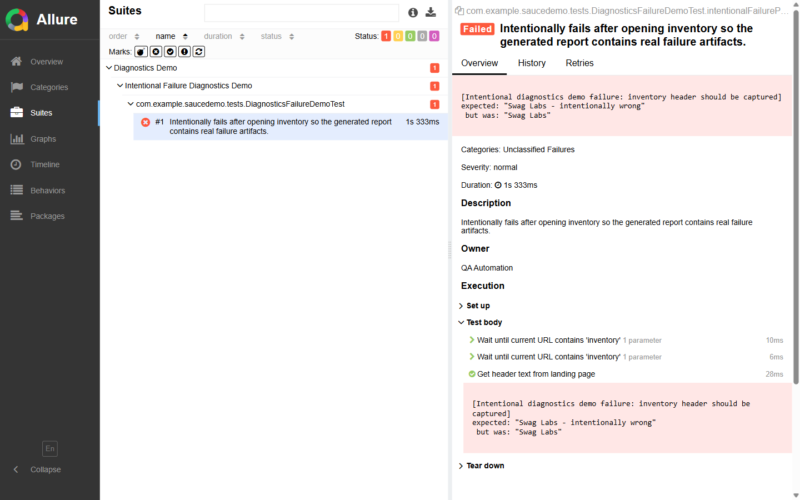
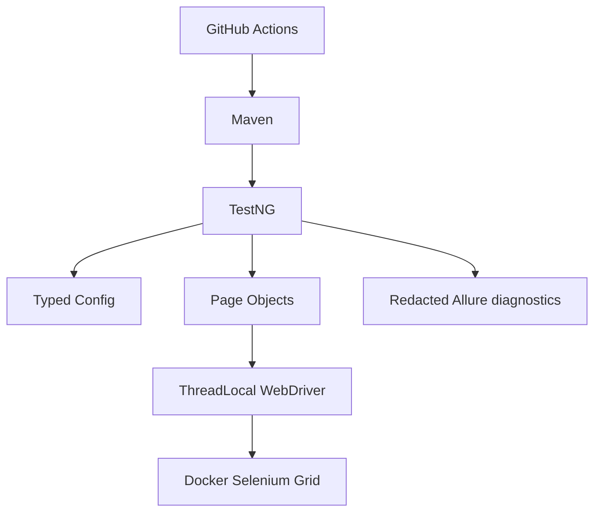
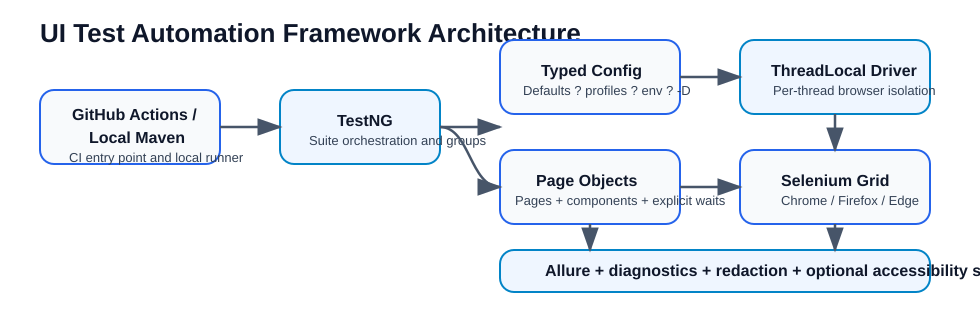

# Selenium TestNG Java Framework

[](https://github.com/qa-test-automation-frameworks/selenium-testng-java-framework/actions/workflows/ui-tests.yml)
[](https://qa-test-automation-frameworks.github.io/selenium-testng-java-framework/)


The Java/Selenium counterpart to the Playwright framework: Java 21, Selenium 4,
TestNG, Docker Grid, typed configuration, explicit waits, redaction-aware Allure
diagnostics, and multi-browser CI for teams that still need JVM browser
automation patterns.

This repo intentionally targets one controlled demo app. It demonstrates
framework ownership, Grid-safe execution, diagnostics, and governance rather
than claiming cloud-grid scale or broad application coverage.

## Reviewer Proof

| Evidence | Link |
| --- | --- |
| Live report | [Interactive Allure report](https://qa-test-automation-frameworks.github.io/selenium-testng-java-framework/) |
| Release | [v1.0.0](https://github.com/qa-test-automation-frameworks/selenium-testng-java-framework/releases/tag/v1.0.0) |
| CI | [UI Tests workflow](https://github.com/qa-test-automation-frameworks/selenium-testng-java-framework/actions/workflows/ui-tests.yml) |
| Review guide | [Portfolio review path](docs/PORTFOLIO_REVIEW_GUIDE.md) |
| Best screenshot | [Failed test details](docs/images/allure-failed-test-details-preview.png) |



## What This Framework Proves

| Engineering question | Implemented answer |
| --- | --- |
| How does Java browser execution stay thread-safe? | Thread-local drivers and waits, bounded TestNG workers, and Grid capacity guidance. |
| How is synchronization controlled? | Implicit waits are disabled; page objects use explicit waits only. |
| How are expensive UI flows reduced? | Cookie/API setup shortcuts support non-login scenarios while dedicated tests retain UI login coverage. |
| How are remote failures diagnosed? | Redacted screenshots, page source, capabilities, console logs, network logs, and bounded framework logs attach to Allure. |
| How is governance enforced? | Maven quality gates, focused unit tests, ADRs, retry/quarantine rules, dependency controls, and seeded-defect examples. |

## Quick Start

Prerequisites: JDK 21, Maven wrapper, Docker and Docker Compose for Grid runs.

Run no-secret smoke coverage:

```bash
./mvnw clean test -Dgroups=inventory,cart -Dheadless=true
```

Run Chrome regression with secret-backed login coverage:

```bash
export APP_PASSWORD="<set-outside-repository>"
./mvnw clean verify -Dheadless=true -Dbrowser=CHROME
```

Run through Docker Grid:

```bash
export APP_PASSWORD="<set-outside-repository>"
docker compose up --build --exit-code-from test-runner
```

Generate or serve Allure locally:

```bash
./mvnw allure:report
./mvnw allure:serve
```

PowerShell example:

```powershell
$env:APP_PASSWORD = "<set-outside-repository>"
.\mvnw.cmd clean verify -Dheadless=true -Dbrowser=CHROME
```

## CI and Evidence

- The main workflow compiles and verifies framework quality gates before browser jobs.
- Chrome, Firefox, and Edge run as separate Selenium Grid matrix entries.
- Forked pull requests run no-secret smoke groups; full login coverage requires repository secrets.
- Allure results are merged and published to GitHub Pages from `main`.
- Runtime metrics are written to `target/portfolio-metrics-v1.json` and uploaded per browser.
- Scheduled dependency/SBOM governance and quarantine checks keep evidence current.

## Architecture


```mermaid
graph TD;
    CI[GitHub Actions] --> Maven;
    Maven --> TestNG;
    TestNG --> Config[Typed Config];
    TestNG --> Pages[Page Objects];
    Pages --> WebDriver[ThreadLocal WebDriver];
    WebDriver --> Grid[Docker Selenium Grid];
    TestNG --> Allure[Redacted Allure diagnostics];
```



## Scope and Limits

- The bundled Grid is a lightweight reference Grid, not a high-availability browser farm.
- Accessibility coverage is an opt-in structural smoke suite; it is not a full axe-core audit yet.
- Visual checks use a baseline scaffold and whole-image hash comparisons; they are not pixel-diff tooling.
- Safari remains local headed macOS-only and requires Safari remote automation.
- The product catalog assertions intentionally use static Sauce Demo data.

## Documentation

- [Portfolio Review Guide](docs/PORTFOLIO_REVIEW_GUIDE.md)
- [Architecture Overview](docs/ARCHITECTURE.md)
- [Execution Guide](docs/EXECUTION_GUIDE.md)
- [Test Writing Guide](docs/TEST_WRITING_GUIDE.md)
- [Debugging Guide](docs/DEBUGGING_GUIDE.md)
- [Enterprise Scalability](docs/ENTERPRISE_SCALABILITY.md)
- [Reliability Policy](docs/RELIABILITY_POLICY.md)
- [Architecture Decision Records](docs/adr/README.md)
- [Seeded Defect Examples](docs/seeded-defects.md)
- [Changelog](CHANGELOG.md)

