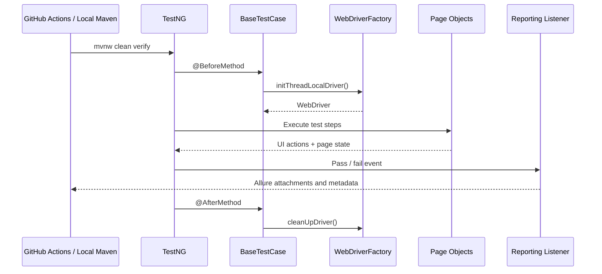
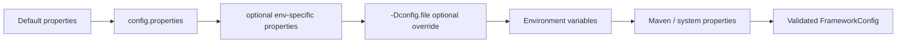

# Framework Architecture

This document describes the architectural design of the UI Test Automation Framework.

## Overview
The framework is built using **Java 21**, **Selenium WebDriver**, and **TestNG**. It follows a multi-layered approach to ensure scalability, maintainability, and parallel execution safety.

## Test Lifecycle Sequence

## Configuration Override Flow

## Layers

### 1. Driver Layer (`com.example.saucedemo.framework.driver`)
- **WebDriverFactory**: Manages the lifecycle of WebDriver instances.
- **ThreadLocal Storage**: Ensures each thread has its own isolated driver instance, enabling safe parallel execution.
- **Shared Wait Helper**: Reuses a thread-local `WaitUtils` instance across pages and components created within the same driver lifecycle.
- **Support**: Supports Chrome, Firefox, and Edge locally. Chrome and Firefox run on Selenium Grid by default, and Edge is available through the optional Docker Compose `edge` profile and GitHub Actions matrix. Safari is local macOS-only experimental support.

### 2. Configuration Layer (`com.example.saucedemo.framework.config`)
- **Custom Typed Loader**: Uses `FrameworkConfig` plus `ConfigFactory` for typed configuration without depending on an unmaintained external library.
- **Multi-Environment**: Supports different profiles (QA, DEV) via `.properties` files.
- **Security**: Sensitive data (like passwords) are externalized via environment variables.
- **Override Order**: Defaults are loaded first, then optional `config.properties`, then optional `${env}.properties`, then an optional external `-Dconfig.file`, then environment variables, then Maven/system properties.

### 3. Page Object Model (`com.example.saucedemo.framework.pageobject`)
- **BasePage**: The foundation for all page objects, providing common interaction methods and wait strategies.
- **Stateless Design**: Page Objects represent the UI state and actions but do not contain assertions (delegated to the test layer).
- **Explicit Readiness**: Page objects are constructed lazily; callers invoke `waitUntilLoaded()` explicitly when page readiness must be asserted.
- **Component Model**: Complex UI elements (like Headers) are extracted into reusable components.
- **Source Set**: Framework and orchestration code lives under `src/main/java`; concrete TestNG scenarios stay under `src/test/java`.

### 4. Test Layer (`tests`)
- **BaseTestCase**: Handles setup (`BeforeMethod`) and teardown (`AfterMethod`) of the driver.
- **UITests**: Implementation of business scenarios.
- **AssertJ**: Used for fluent, descriptive assertions with business-level error messages.
- **Automation-Only Scope**: `src/test/java` is intentionally reserved for TestNG UI automation scenarios, test data, and supporting orchestration rather than a separate framework unit-test layer.

### 5. Reporting Layer (`com.example.saucedemo.framework.listener`)
- **Allure Reporting**: Integrated via a custom listener to capture URL, browser capabilities, configurable screenshots, configurable page source, configurable console logs, optional network logs, optional Selenium Grid video links, configurable framework log excerpts, and environment details on failure.
- **Step Annotations**: `@Step` used in Page Objects for detailed action tracking in reports.

### 6. CI and Quality Gates
- **GitHub Actions**: Runs formatting checks, Checkstyle, PMD, SpotBugs, browser-matrix UI execution against Selenium Grid, artifact upload, Allure history preservation, GitHub Pages deployment for Allure on `main`, and scheduled dependency governance/SBOM tasks.
- **Dependabot**: Keeps Maven, Docker, and GitHub Actions dependencies on an automated weekly update cadence.

## Design Principles
- **Fail-Fast**: Configuration and environment checks happen at startup.
- **Deterministic Waits**: Only explicit waits are used (no `Thread.sleep` or implicit waits).
- **Automation-Focused Scope**: The repository emphasizes reusable UI automation architecture and end-to-end execution rather than maintaining a separate framework unit-test layer.
- **Clean Code**: Code style and bug-pattern detection are enforced via Checkstyle (Google Checks), Spotless, PMD, SpotBugs, and Maven Enforcer during `verify`.

## Docker Grid Troubleshooting
- Ensure Docker Desktop is running before `docker compose up`.
- Start Docker Compose with `--profile edge` when you want an Edge node in the local Grid.
- If Selenium Grid is slow to become healthy, rerun the command after the hub and browser nodes finish starting.
- Use `-Dexecution.type=remote -Dremote.url=http://localhost:4444/wd/hub` for local grid runs.
- Keep browser names aligned with supported values: `CHROME`, `FIREFOX`, `EDGE`, or `SAFARI`.

