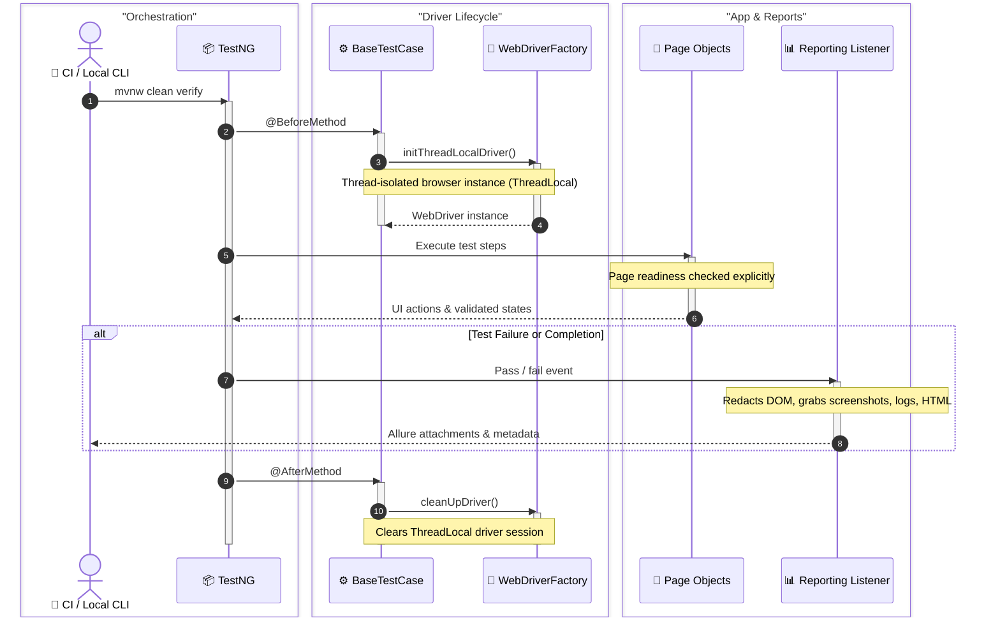
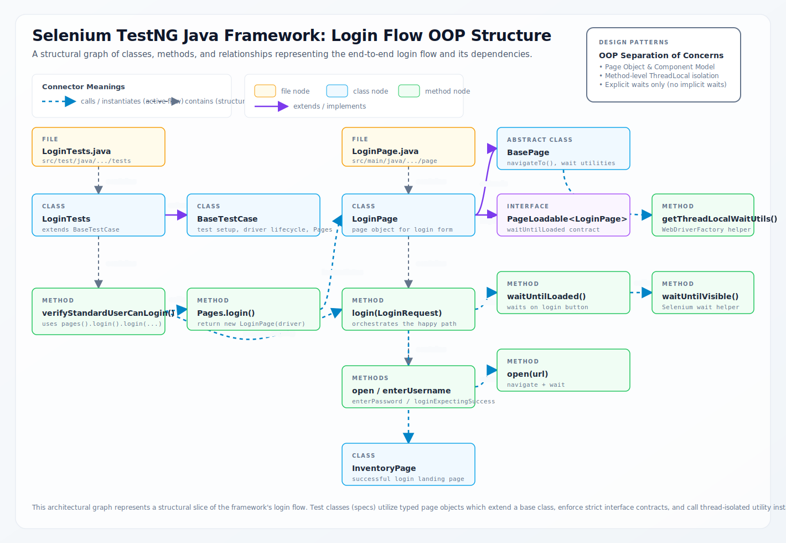

# Selenium TestNG Java Framework Architecture

This document describes the architectural design of the Selenium TestNG Java Framework.

## Overview
The framework is built using **Java 21**, **Selenium WebDriver**, and **TestNG**. It follows a multi-layered approach to ensure scalability, maintainability, and parallel execution safety.

## Test Lifecycle Sequence

## Login Flow OOP Architecture

This structural slice of the codebase illustrates how test cases, page objects, abstract base page contracts, and driver/wait utilities interact in a typical functional user flow (the Login flow):

## Configuration Override Flow

```mermaid
flowchart LR
    %% Nodes definition with distinct shapes and emojis
    Defaults(["📄 1. Built-in Defaults"])
    BaseConfig["📁 2. config.properties<br/>(Classpath)"]
    EnvProfile["🌍 3. qa/dev.properties<br/>(Env Profile)"]
    ExternalFile["💾 4. external.properties<br/>(-Dconfig.file)"]
    Environment["💻 5. OS Env Variables<br/>(APP_PASSWORD, etc.)"]
    SystemProps["⚡ 6. System Properties<br/>(-Dbrowser, etc.)"]
    FinalConfig{{"⚙️ Validated FrameworkConfig"}}

    %% Links with descriptive styling
    Defaults -->|Overridden by| BaseConfig
    BaseConfig -->|Overridden by| EnvProfile
    EnvProfile -->|Overridden by| ExternalFile
    ExternalFile -->|Overridden by| Environment
    Environment -->|Overridden by| SystemProps
    SystemProps -->|Loads & Validates| FinalConfig

    %% Style classes / inline styles
    style Defaults fill:#ECEFF1,stroke:#90A4AE,stroke-width:2px,color:#37474F
    style BaseConfig fill:#E8F5E9,stroke:#81C784,stroke-width:2px,color:#2E7D32
    style EnvProfile fill:#E8F5E9,stroke:#4CAF50,stroke-width:2px,color:#1B5E20
    style ExternalFile fill:#E8F5E9,stroke:#2E7D32,stroke-width:2px,color:#0D5302
    style Environment fill:#FFF3E0,stroke:#FFB74D,stroke-width:2px,color:#E65100
    style SystemProps fill:#FFF3E0,stroke:#F57C00,stroke-width:2px,color:#B75300
    style FinalConfig fill:#E0F2F1,stroke:#009688,stroke-width:3px,color:#004D40
```

## Layers

### 1. Driver Layer (`io.github.selenium.saucedemo.framework.driver`)
- **WebDriverFactory**: Manages the lifecycle of WebDriver instances.
- **ThreadLocal Storage**: Ensures each thread has its own isolated driver instance, enabling safe parallel execution.
- **Shared Wait Helper**: Reuses a thread-local `WaitUtils` instance across pages and components created within the same driver lifecycle.
- **Support**: Supports Chrome, Firefox, and Edge locally. Chrome and Firefox run on Selenium Grid by default, and Edge is available through the optional Docker Compose `edge` profile and GitHub Actions matrix. Safari is local macOS-only experimental support.

### 2. Configuration Layer (`io.github.selenium.saucedemo.framework.config`)
- **Custom Typed Loader**: Uses `FrameworkConfig` plus `ConfigFactory` for typed configuration without depending on an unmaintained external library.
- **Multi-Environment**: Supports environment profiles via `.properties` files or external `-Dconfig.file` overrides. The default `qa` environment can use built-in safe defaults; non-default environments fail fast if no profile or external config is supplied.
- **Security**: Sensitive data (like passwords) are externalized via environment variables.
- **Override Order**: Defaults are loaded first, then optional `config.properties`, then optional `${env}.properties`, then an optional external `-Dconfig.file`, then environment variables, then Maven/system properties.

### 3. Page Object Model (`io.github.selenium.saucedemo.app.ui.page`)
- **Framework UI Primitives**: `io.github.selenium.saucedemo.framework.ui` contains reusable base page/component contracts and shared wait access.
- **App Page Objects**: Sauce Demo-specific pages live under `io.github.selenium.saucedemo.app.ui.page`; reusable page fragments live under `io.github.selenium.saucedemo.app.ui.component`.
- **Route Model**: Sauce Demo routes live in `AppRoute`, so protected-route tests and page readiness checks share the same route definitions.
- **Stateless Design**: Page Objects represent the UI state and actions but do not contain assertions (delegated to the test layer).
- **Explicit Readiness**: Page objects are constructed lazily; callers invoke `waitUntilLoaded()` explicitly when page readiness must be asserted. Readiness means URL plus the minimum interactive controls and content required by that page.
- **Component Model**: Complex app UI elements, such as headers, product lists, and root-scoped product items, are extracted into app-specific components.
- **Source Set**: Framework and orchestration code lives under `src/main/java`; concrete TestNG scenarios stay under `src/test/java`.

### 4. Test Layer (`tests`)
- **BaseTestCase**: Handles setup (`BeforeMethod`) and teardown (`AfterMethod`) of the driver.
- **UITests**: Implementation of business scenarios, including focused negative checks and end-to-end user journeys that increase coverage quality without inflating metrics.
- **Accessibility Smoke**: An opt-in `testng-accessibility.xml` suite runs a narrow baseline accessibility probe without polluting the default functional regression path.
- **AssertJ**: Used for fluent, descriptive assertions with business-level error messages.

### 5. Reporting Layer (`io.github.selenium.saucedemo.framework.listener`)
- **Allure Reporting**: Integrated via a custom listener to capture redacted URL/environment details, browser capabilities, configurable screenshots after DOM masking, redacted page source, configurable console logs, explicit unavailable diagnostics, optional network logs, optional Selenium Grid video links, configurable framework log excerpts, suite-level retry summaries, and Allure categories copied into generated results.
- **Step Annotations**: `@Step` used in Page Objects for detailed action tracking in reports.

### 6. CI and Quality Gates
- **GitHub Actions**: Runs formatting checks, Checkstyle, PMD, SpotBugs, browser-matrix UI execution against Selenium Grid, artifact upload, Allure history preservation, GitHub Pages deployment for Allure on `main`, and scheduled dependency governance/SBOM tasks.
- **Dependabot**: Keeps Maven, Docker, and GitHub Actions dependencies on an automated weekly update cadence.

## Design Principles
- **Fail-Fast**: Configuration and environment checks happen at startup.
- **Deterministic Waits**: Only explicit waits are used (no `Thread.sleep` or implicit waits).
- **Automation-Focused Scope**: The repository emphasizes reusable UI automation architecture and end-to-end execution. ADR 005 keeps automated validation focused on browser-driven scenarios instead of framework-only tests.
- **Method-Level Isolation**: Each test method starts with a clean browser session. This is intentionally more expensive than driver reuse, but it keeps UI state leakage out of parallel runs.
- **Clean Code**: Code style and bug-pattern detection are enforced via Checkstyle (Google Checks), Spotless, PMD, SpotBugs, and Maven Enforcer during `verify`.

## Docker Grid Troubleshooting
- Ensure Docker Desktop is running before `docker compose up`.
- Start Docker Compose with `--profile edge` when you want an Edge node in the local Grid.
- If Selenium Grid is slow to become healthy, rerun the command after the hub and browser nodes finish starting.
- Use `-Dexecution.type=remote -Dremote.url=http://localhost:4444/wd/hub` for local grid runs.
- Keep browser names aligned with supported values: `CHROME`, `FIREFOX`, `EDGE`, or `SAFARI`.
- Prefer Docker Grid for reproducible browser diagnostics. Local evergreen browsers can be newer than Selenium's packaged DevTools artifacts and may emit CDP compatibility warnings even when functional tests pass.
- Docker images are version-tag and digest pinned for reproducibility. Refresh image digests when Dependabot updates Selenium Grid tags.
