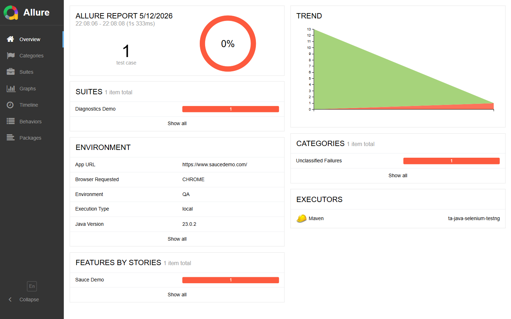
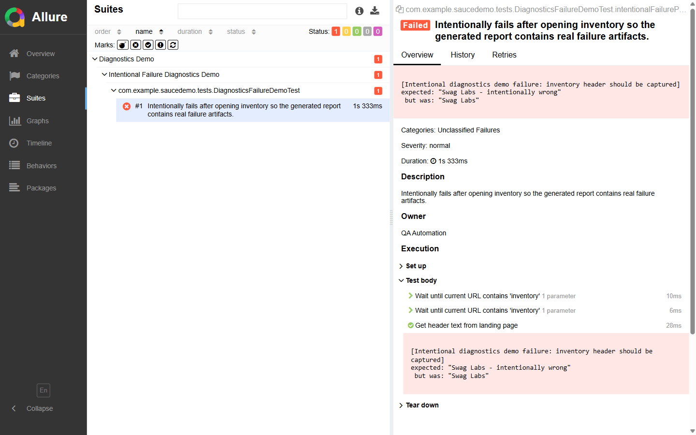
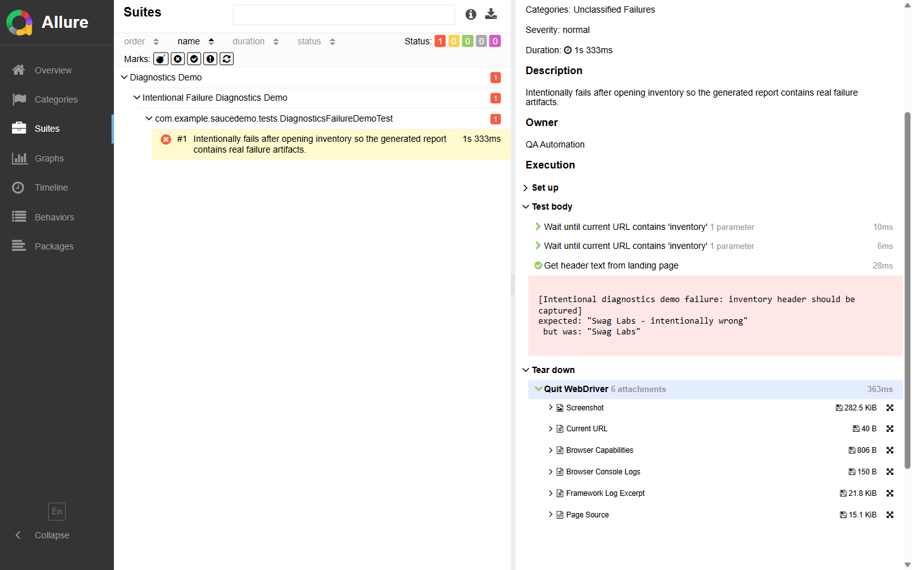
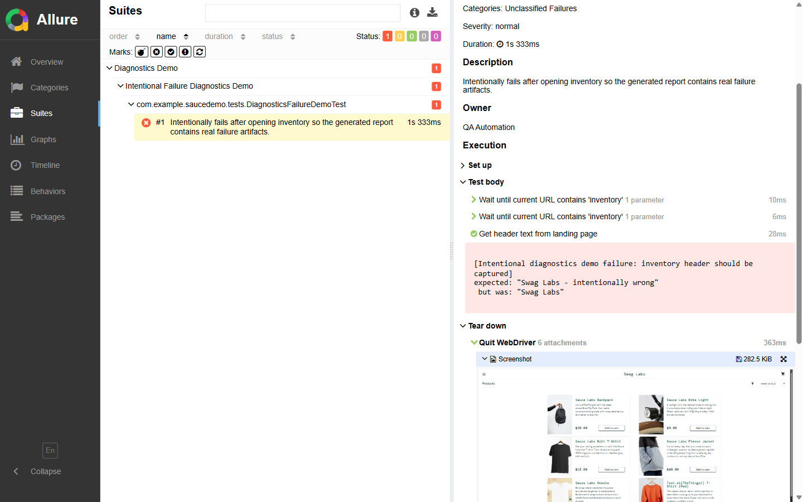

# Debugging Guide

This guide documents the practical journey for someone using this framework to run tests, inspect a failure, and turn Allure artifacts into a clear root-cause analysis.

The screenshots below come from a real local Allure report generated after an intentional assertion failure. The failure opened the Sauce Demo inventory page, asserted the wrong header text, and allowed the framework to collect diagnostics before quitting the browser.

## 1. Run the right scope first

Start with the smallest suite that can reproduce the behavior.

```powershell
.\mvnw.cmd test '-Dgroups=inventory,cart' -Dheadless=true -Dbrowser=CHROME
```

Run with parallelism when validating thread safety or a CI-like smoke path.

```powershell
.\mvnw.cmd test '-Dgroups=inventory,cart' -Dheadless=true -Dbrowser=CHROME '-Dthread.count=2'
```

Run a trusted full UI regression only when `APP_PASSWORD` is available.

```powershell
.\mvnw.cmd clean test -Dheadless=true -Dbrowser=CHROME '-Dthread.count=2'
```

Useful switches:

| Switch | Use |
|---|---|
| `-Dgroups=inventory,cart,checkout` | Limit execution to relevant TestNG groups. |
| `-Dbrowser=CHROME` | Choose `CHROME`, `FIREFOX`, `EDGE`, or a supported local browser. |
| `-Dheadless=true` | Use CI-style browser execution locally. |
| `-Dthread.count=2` | Validate thread-local driver isolation. |
| `-Ddiagnostics.network.logs.enabled=true` | Attach network/performance logs where the browser session supports them. |
| `-Dexecution.type=remote -Dremote.url=http://localhost:4444/wd/hub` | Run against Selenium Grid. |

## 2. Generate the report

Generate the Allure report after the UI run. This works even when the test phase failed, as long as `target/allure-results` exists.

```powershell
.\mvnw.cmd allure:report -DskipTests
```

Open the generated report:

```powershell
python -m http.server 37642 --bind 127.0.0.1 --directory target/allure-report
```

Then browse to `http://127.0.0.1:37642/index.html`.

## 3. Read the failure summary

The overview immediately shows whether the run has failed, broken, skipped, or passed tests.



Use this first view to answer:

- Is this a product assertion failure, a setup/configuration issue, or infrastructure noise?
- Is the failure isolated to one test, one suite, one browser, or one environment?
- Did the run use the expected browser, environment, app URL, Java version, and execution type?

## 4. Open the failed test

Go to `Suites`, expand the suite tree, and select the failed test.



Start with the red assertion block. In the intentional failure run, the assertion makes the issue obvious:

```text
expected: "Swag Labs - intentionally wrong"
 but was: "Swag Labs"
```

For real failures, read this block before opening screenshots. A strong assertion message should state the business expectation, not only the raw technical mismatch.

## 5. Walk the execution steps

The `Execution` section is the path the test took through the framework. It shows setup, test-body steps, and teardown diagnostics.

Use the steps to answer:

- Did the test reach the expected page before failing?
- Which page-object action was the last successful step?
- Did the failure happen in setup, the test body, or teardown?
- Was the failing assertion close to the user behavior it claims to validate?

In the sample failure, the test reached inventory and successfully read the header before the intentional assertion failed.

## 6. Inspect failure artifacts

Failure diagnostics are attached under `Tear down > Quit WebDriver` because the framework captures them in `BaseTestCase.afterMethod` before the browser is closed.



The default artifact set is:

| Artifact | What to use it for |
|---|---|
| `Screenshot` | Confirm what the user would have seen at failure time. Fields matched by `diagnostics.sensitive.dom.selectors` are masked before capture. |
| `Current URL` | Verify route, redirect behavior, and environment targeting. |
| `Browser Capabilities` | Confirm browser name/version, platform, headless mode, remote/local execution, and CDP metadata. |
| `Browser Console Logs` | Look for client-side errors, warnings, and unsupported browser logging. |
| `Framework Log Excerpt` | Correlate framework actions, page-object logs, retries, diagnostics, and driver lifecycle events. |
| `Page Source` | Inspect DOM state when the screenshot alone is not enough. Text attachments are redacted. |

The screenshot attachment is the fastest way to validate whether the application state matches the failure message.



## 7. Classify the issue

Use the artifacts together rather than relying on one signal.

| Signal | Likely interpretation |
|---|---|
| Assertion mismatch and correct screenshot | Product changed or expected data is stale. |
| Screenshot shows wrong route and current URL confirms redirect | Authentication, routing, or session setup issue. |
| Page source has expected element but screenshot does not | Timing, viewport, visibility, or styling issue. |
| Browser logs show application errors | Product-side JavaScript or frontend runtime issue. |
| Framework log stops during driver creation or navigation | Browser, network, Selenium, or environment issue. |
| Capabilities show unexpected browser/version | Local setup or CI matrix configuration issue. |

## 8. Reproduce with more signal

If the initial report is not enough, rerun with a tighter scope and additional diagnostics.

```powershell
.\mvnw.cmd test '-Dgroups=checkout' -Dheadless=false -Dbrowser=CHROME -Ddiagnostics.network.logs.enabled=true
```

Use headed mode when you need to watch the UI. Use network logs only when they add value, because browser support varies and unsupported sessions will attach an explicit unavailable message.

For the opt-in accessibility smoke suite, run the dedicated suite file so the report stays focused on accessibility findings:

```powershell
.\mvnw.cmd test '-Dtestng.suite.file=testng-accessibility.xml' '-Dgroups=accessibility' -Dheadless=true -Dbrowser=CHROME
```

The resulting Allure run includes an `Accessibility baseline findings` attachment for blocking issues and an `Accessibility structural advisories` attachment for non-blocking observations that still deserve review.

## 9. Debug CI failures

In GitHub Actions:

- Open the failing browser matrix job.
- Download `allure-results-*` and `allure-report-*` artifacts.
- Check whether the failure reproduces across browsers or only one browser.
- Review the merged GitHub Pages report on `main` for trend/context.
- For forked PRs, remember the workflow intentionally runs no-secret smoke coverage only.

In Jenkins:

- Open the archived Allure report.
- Inspect `target/surefire-reports/**`, `target/logs/**`, and `target/allure-results/**`.
- Confirm the selected `BROWSER`, `GROUPS`, `HEADLESS`, `THREAD_COUNT`, and Grid URL parameters.

## 10. Convert evidence into a fix

A mature failure note should include:

- The failing test name and group.
- The exact assertion or exception.
- The screenshot state.
- The current URL.
- The last successful page-object step.
- Relevant browser capability details.
- Whether the issue is product behavior, test data drift, framework behavior, infrastructure, or environment configuration.

Avoid broad fixes until the artifacts support them. If only one browser fails, start with browser capability and console logs. If the screenshot and DOM disagree, start with waits and visibility. If the current URL is wrong, start with navigation or authentication setup.
